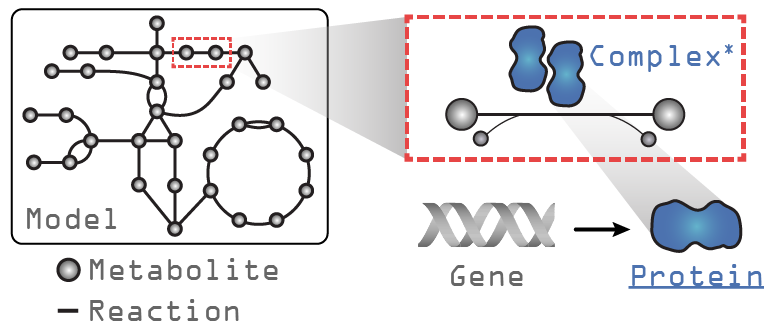
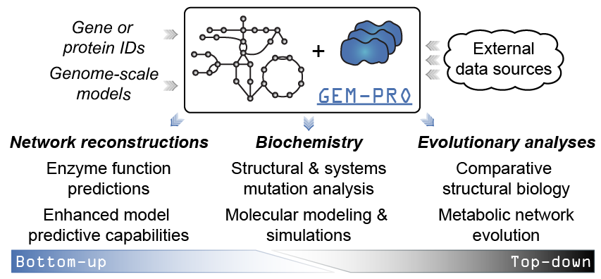

.. _gempro:

********************
The GEM-PRO Pipeline
********************

Tutorials
=========

.. toctree::
   :glob:
   :maxdepth: 1

   notebooks/GEM-PRO*

Introduction
============

The GEM-PRO pipeline is focused on annotating genome-scale models with protein structure information. Any SBML model can be used as input to the pipeline, although it is not required to have a one. Here are the possible starting points for using the pipeline:

#. An SBML model in ``SBML`` (``.sbml``, ``.xml``), or ``MATLAB`` (``.mat``) formats
#. A list of gene IDs (``['b0001', 'b0002', ...]``)
#. A dictionary of gene IDs and their sequences (``{'b0001':'MSAVEVEEAP..', 'b0002':'AERAPLS', ...}``)

A GEM-PRO object can be thought of at a high-level as simply an annotation project. Creating a new project with any of the above starting points will create a new folder where protein sequences and structures will be downloaded to.

Features
========

* Automated mapping of sequence IDs
* Consolidating sequence IDs and setting a representative sequence
* Mapping of representative sequence --> structures
* Preparation of files for homology modeling (currently for I-TASSER_)
* Running QC/QA on structures and setting a representative structure
* Automation of protein sequence and structure property calculation
* Creation of Pandas DataFrame summaries directly from downloaded metadata

COBRApy model additions
=======================

Let's take a look at a GEM loaded with *ssbio* and what additions exist compared to a GEM loaded with COBRApy_. In the figure above, the text in grey indicates objects that exist in a ``COBRApy`` ``Model`` object, and in blue, the attributes added when loading with *ssbio*. Please note that the ``Complex`` object is still under development and currently non-functional.

COBRApy
-------

Under construction...

ssbio
-----

Under construction...

.. see: https://structure.dynamic.ucsd.edu:9998/notebooks/projects_unsynced/sandbox/171212-ssbio_random.ipynb
        .. my_gene_id = 'geneABC'
        .. my_protein = my_model.genes.get_by_id(my_gene_id).protein
        .. my_protein.sequences  # Contains a list of stored amino-acid sequences
        .. my_protein.structures  # Contains a list of stored 3D structures
        .. My_protein.representative_sequence  # Single representative amino-acid sequence
        .. My_protein.representative_structure  # Single representative 3D structure

Use cases
=========

When would you create or use a GEM-PRO? The added context of manually curated network interactions to protein structures enables different scales of analyses. For instance...

From the "top-down":
--------------------

* Global non-variant properties of protein structures such as the distribution of fold types can be compared within or between organisms [1]_, [2]_, [3]_, elucidating adaptations that are reflected in the structural proteome.
* Multi-strain modelling techniques ([10]_, [11]_, [12]_) would allow strain-specific changes to be investigated at the molecular level, potentially explaining phenotypic differences or strain adaptations to certain environments.

From the "bottom-up"
--------------------

* Structural properties predicted from sequence or calculated from structure can be utilized to enhance model predictive capabilities [4]_, [5]_, [6]_, [7]_, [8]_, [9]_

File organization
=================

Files such as sequences, structures, alignment files, and property calculation outputs can optionally be cached on a user's disk to minimize calls to web services, limit recalculations, and provide direct inputs to common sequence and structure algorithms which often require local copies of the data. For a GEM-PRO project, files are organized in the following fashion once a root directory and project name are set:

.. code-block:: bash

    <ROOT_DIR>
    └── <PROJECT_NAME>
          ├── data  # General directory for pipeline outputs
          ├── model  # SBML and GEM-PRO models are stored in this directory
          └── genes  # Per gene information
                └── <gene_id1>  # Specific gene directory
                      └── <protein_id1>  # Protein directory
                            ├── sequences  # Protein sequence files, alignments, etc.
                            └── structures  # Protein structure files, calculations, etc.

Further reading
===============

For examples in which structures have been integrated into a GEM and utilized on a genome-scale, please see the following:

.. [1] Zhang Y, Thiele I, Weekes D, Li Z, Jaroszewski L, Ginalski K, et al. Three-dimensional structural view of the central metabolic network of Thermotoga maritima. Science. 2009 Sep 18;325(5947):1544–9. Available from: http://dx.doi.org/10.1126/science.1174671
.. [2] Brunk E, Mih N, Monk J, Zhang Z, O'Brien EJ, Bliven SE, et al. Systems biology of the structural proteome. BMC Syst Biol. 2016;10: 26. doi:10.1186/s12918-016-0271-6
.. [3] Monk JM, Lloyd CJ, Brunk E, Mih N, Sastry A, King Z, et al. iML1515, a knowledgebase that computes Escherichia coli traits. Nat Biotechnol. 2017;35: 904–908. doi:10.1038/nbt.3956
.. [4] Chang RL, Xie L, Xie L, Bourne PE, Palsson BØ. Drug off-target effects predicted using structural analysis in the context of a metabolic network model. PLoS Comput Biol. 2010 Sep 23;6(9):e1000938. Available from: http://dx.doi.org/10.1371/journal.pcbi.1000938
.. [5] Chang RL, Andrews K, Kim D, Li Z, Godzik A, Palsson BO. Structural systems biology evaluation of metabolic thermotolerance in Escherichia coli. Science. 2013 Jun 7;340(6137):1220–3. Available from: http://dx.doi.org/10.1126/science.1234012
.. [6] Chang RL, Xie L, Bourne PE, Palsson BO. Antibacterial mechanisms identified through structural systems pharmacology. BMC Syst Biol. 2013 Oct 10;7:102. Available from: http://dx.doi.org/10.1186/1752-0509-7-102
.. [7] Mih N, Brunk E, Bordbar A, Palsson BO. A Multi-scale Computational Platform to Mechanistically Assess the Effect of Genetic Variation on Drug Responses in Human Erythrocyte Metabolism. PLoS Comput Biol. 2016;12: e1005039. doi:10.1371/journal.pcbi.1005039
.. [8] Chen K, Gao Y, Mih N, O'Brien EJ, Yang L, Palsson BO. Thermosensitivity of growth is determined by chaperone-mediated proteome reallocation. Proceedings of the National Academy of Sciences. 2017;114: 11548–11553. doi:10.1073/pnas.1705524114
.. [9] Yang L, Mih N, Yurkovich JT, Park JH, Seo S, Kim D, et al. Multi-scale model of the proteomic and metabolic consequences of reactive oxygen species. bioRxiv. 2017. p. 227892. doi:10.1101/227892

References
==========

.. [10] Bosi, E, Monk, JM, Aziz, RK, Fondi, M, Nizet, V, & Palsson, BO. (2016). Comparative genome-scale modelling of Staphylococcus aureus strains identifies strain-specific metabolic capabilities linked to pathogenicity. Proceedings of the National Academy of Sciences of the United States of America, 113/26: E3801–9. DOI: 10.1073/pnas.1523199113
.. [11] Monk, JM, Koza, A, Campodonico, MA, Machado, D, Seoane, JM, Palsson, BO, Herrgård, MJ, et al. (2016). Multi-omics Quantification of Species Variation of Escherichia coli Links Molecular Features with Strain Phenotypes. Cell systems, 3/3: 238–51.e12. DOI: 10.1016/j.cels.2016.08.013
.. [12] Ong, WK, Vu, TT, Lovendahl, KN, Llull, JM, Serres, MH, Romine, MF, & Reed, JL. (2014). Comparisons of Shewanella strains based on genome annotations, modeling, and experiments. BMC systems biology, 8: 31. DOI: 10.1186/1752-0509-8-31

.. Links

.. _COBRApy: http://opencobra.github.io/cobrapy/
.. _I-TASSER: https://zhanglab.ccmb.med.umich.edu/I-TASSER/