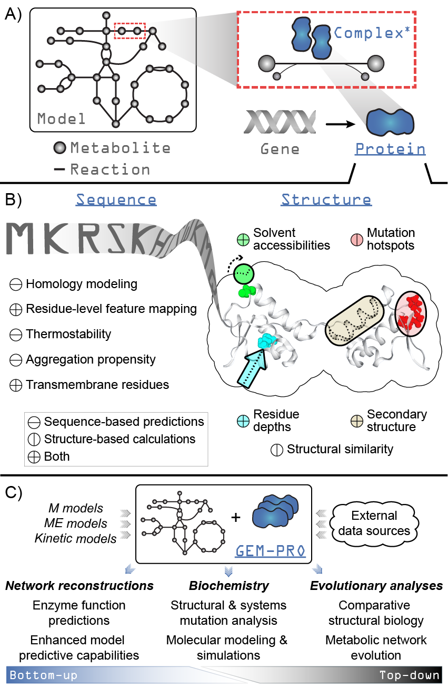
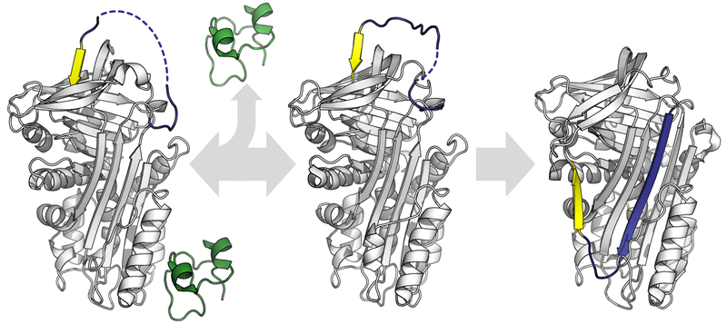

.. _getting_started:

***************
Getting Started
***************

Introduction
============

This section will give a quick outline of the design of *ssbio* and the scientific topics behind it. If you would like to read a pre-print version of the manuscript, please see [1]_.

   Overview of the design and functionality of *ssbio*. Underlined fixed-width text in blue indicates added functionality to COBRApy for a genome-scale model loaded using *ssbio*. A) A simplified schematic showing the addition of a Protein to the core objects of COBRApy (fixed-width text in gray). A gene is directly associated with a protein, which can act as a monomeric enzyme or form an active complex with itself or other proteins (the asterisk denotes that methods for complexes are currently under development). B) Summary of properties and functions available for a protein sequence and structure. C) Uses of a GEM-PRO, from the bottom-up and the top-down. Once all protein sequences and structures are mapped to a genome-scale model, the resulting GEM-PRO has uses in multiple areas of study.

The basics
==========

*ssbio* was developed with simplicity in mind - we wanted to make it as easy as possible to work with protein sequences and structures. Furthermore, we didn't want to reinvent the wheel wherever possible, thus systems models are treated as a direct extension of COBRApy_, and Biopython_ classes and modules are used wherever possible. To best explain the utility of the package, we will outline its features from 2 different viewpoints: as a systems biologist used to looking at the "big picture"; and as a structural biologist where the "devil is in the details".

From a systems perspective
--------------------------

Systems biology is broadly concerned with the modeling and understanding of complex biological systems. What you may be taught in biochemistry 101 at this level will usually be reflected in a kind of interaction map, such as metabolic map shown here:

.. figure:: ./assets/metabolic_metro_map.png
   :scale: 60 %
   :alt: Metabolic Metro Map
   :align: center

   A "metabolic metro map". By Dctrzl, changed work of Chakazul [`CC BY-SA 4.0`_], via `Wikimedia Commons 1`_

This map details the reactions needed to sustain the metabolic function of a cell. Typically, nodes will represent enzymes, and edges the metabolites they act upon (this is reversed in some graphical representations). There can be hundreds or thousands of reactions being modeled at once, *in silico*. These models can be stored in a single file, such as the Systems Biology Markup Language (SBML_). *ssbio* can load SBML models, and so far we have mainly used it in the further annotation of genome-scale metabolic models, or GEMs. The goal of GEMs is to provide a comprehensive annotation of all the metabolic enzymes encoded within a genome, along with a generating a computable model (such as at a steady state, using constraint-based modeling methods, a.k.a. COBRA_). That brings us to our first class: the ``GEMPRO`` object.

The objectives of the GEM-PRO pipeline (genome-scale models integrated with protein structures) have previously been detailed [2]_. A GEM-PRO directly integrates structural information within a curated GEM, and streamlines identifier mapping, representative object selection, and property calculation for a set of proteins. The pipeline provided in *ssbio* functions with an input of a GEM (or any other kind of network model that can be loaded with COBRApy_), but if this is unfamiliar to you, do not fret! A GEM-PRO can be built simply from a list of gene/protein IDs, and can simply be treated as a way to easily analyze a large number of proteins at once.

See :ref:`gempro` for a detailed explanation of this object, Jupyter notebook tutorials of prospective use cases, and an explanation of select functions.

From a structures perspective
-----------------------------

Structural biology is broadly concerned with elucidating and understanding the structure and function of proteins and other macromolecules. Ribbons, molecules, and chemical interactions are the name of the game here:

   A protein undergoing conformational changes. By Thomas Shafee (Own work) [`CC BY 4.0`_], via `Wikimedia Commons 2`_

An abundance of information is stored within structural data, and we believe that it should not be ignored even when looking at thousands of proteins at once within a systems model. To that end, the ``Protein`` object aims to integrate analyses on the level of a single protein's sequence (and related sequences) along with its available structures.

A ``Protein`` is representative of its associated gene's translated polypeptide chain (in other words, we are only considering monomers at this point). The object holds related amino acid sequences and structures, allowing for a single representative sequence and structure to be set from these. Multiple available structures such as those from PDB or homology models can be subjected to QC/QA based on set cutoffs such as sequence coverage and X-ray resolution. Proteins with no structures available can be prepared for homology modeling through the I-TASSER_ platform. Biopython_ representations of sequences (``SeqRecord`` objects) and structures (``Structure`` objects) are utilized to allow access to analysis functions available for their respective objects.

See :ref:`protein` for a detailed explanation of this object, Jupyter notebook tutorials of prospective use cases, and an explanation of select functions.

Modules & submodules
====================

*ssbio* is organized into the following submodules for defined purposes. Please see the :ref:`python_api` for function documentation.

#. ``ssbio.databases``: modules that heavily depend on the Bioservices_ package [3]_ and custom code to enable pulling information from web services such as UniProt, KEGG, and the PDB, and to directly convert that information into sequence and structure objects to load into a protein.
#. ``ssbio.protein.sequence``: modules which allow a user to execute and parse sequence-based utilities such as sequence alignment algorithms or structural feature predictors.
#. ``ssbio.protein.structure``: modules that mirror the sequence module but instead work with structural information to calculate properties, and also to streamline the generation of homology models as well as to prepare structures for molecular modeling tools such as docking or molecular dynamics.
#. ``ssbio.pipeline.gempro``: a pipeline that simplifies the execution of these tools per protein while placing them into the context of a genome-scale model.

References
==========

.. [1] Mih N, Brunk E, Chen K, Catoiu E, Sastry A, Kavvas E, et al. ssbio: A Python Framework for Structural Systems Biology. bioRxiv. 2017. p. 165506. doi:10.1101/165506
.. [2] Brunk E, Mih N, Monk J, Zhang Z, O’Brien EJ, Bliven SE, et al. Systems biology of the structural proteome. BMC Syst Biol. 2016;10: 26. doi:10.1186/s12918-016-0271-6
.. [3] Cokelaer, T, Pultz, D, Harder, LM, Serra-Musach, J, & Saez-Rodriguez, J. (2013). BioServices: a common Python package to access biological Web Services programmatically. Bioinformatics, 29/24: 3241–2. DOI: 10.1093/bioinformatics/btt547

.. Links

.. _COBRA: http://opencobra.github.io/
.. _COBRApy: http://opencobra.github.io/cobrapy/
.. _Biopython: http://biopython.org/wiki/Biopython
.. _Bioservices: http://bioservices.readthedocs.io/en/master/
.. _SBML: http://sbml.org/Main_Page
.. _I-TASSER: https://zhanglab.ccmb.med.umich.edu/I-TASSER/
.. _Wikimedia Commons 1: https://commons.wikimedia.org/wiki/File:Metabolic_Metro_Map.svg
.. _CC BY-SA 4.0: https://creativecommons.org/licenses/by-sa/4.0
.. _Wikimedia Commons 2: https://commons.wikimedia.org/wiki/File%3ASerpin_latent_state_(unannotated).png
.. _CC BY 4.0: http://creativecommons.org/licenses/by/4.0