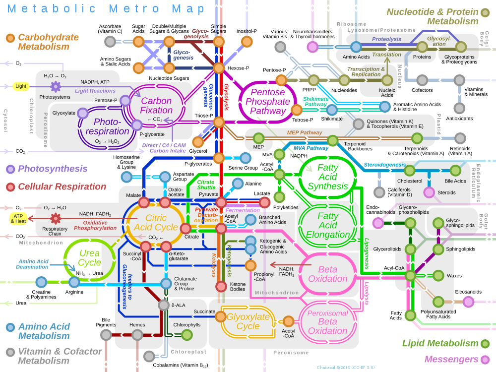

.. _getting_started:

***************
Getting Started
***************

Introduction
============
This section will give a quick outline of the design of ``ssbio`` and the scientific topics behind it.

The basics
==========
``ssbio`` was developed with simplicity in mind, and also as a direct extension of COBRApy_. Furthermore, we didn't want to reinvent the wheel wherever possible, and thus Biopython_ classes and modules are used wherever possible. To best explain the utility of the package, we will explain its features from 2 different viewpoints: 1) as a systems biologist used to looking at the "big picture", ie. from the top-down; and 2) as a structural biologist where the "devil is in the details", ie. from the bottom-up.

A top-down perspective
----------------------

   By Chakazul (Own work) [CC BY-SA 4.0 (https://creativecommons.org/licenses/by-sa/4.0)], via Wikimedia Commons

A bottom-up perspective
-----------------------

Structural biology
==================

This section will give a very brief background on some structural biology topics.

Protein structures
------------------

Systems biology
===============

This section will give a very brief background on some systems biology topics.

COBRA models & COBRApy
----------------------
COBRA_ models & COBRApy_

Reading
=======

.. _COBRA: http://opencobra.github.io/
.. _COBRApy: http://opencobra.github.io/cobrapy/
.. _Biopython: http://biopython.org/wiki/Biopython