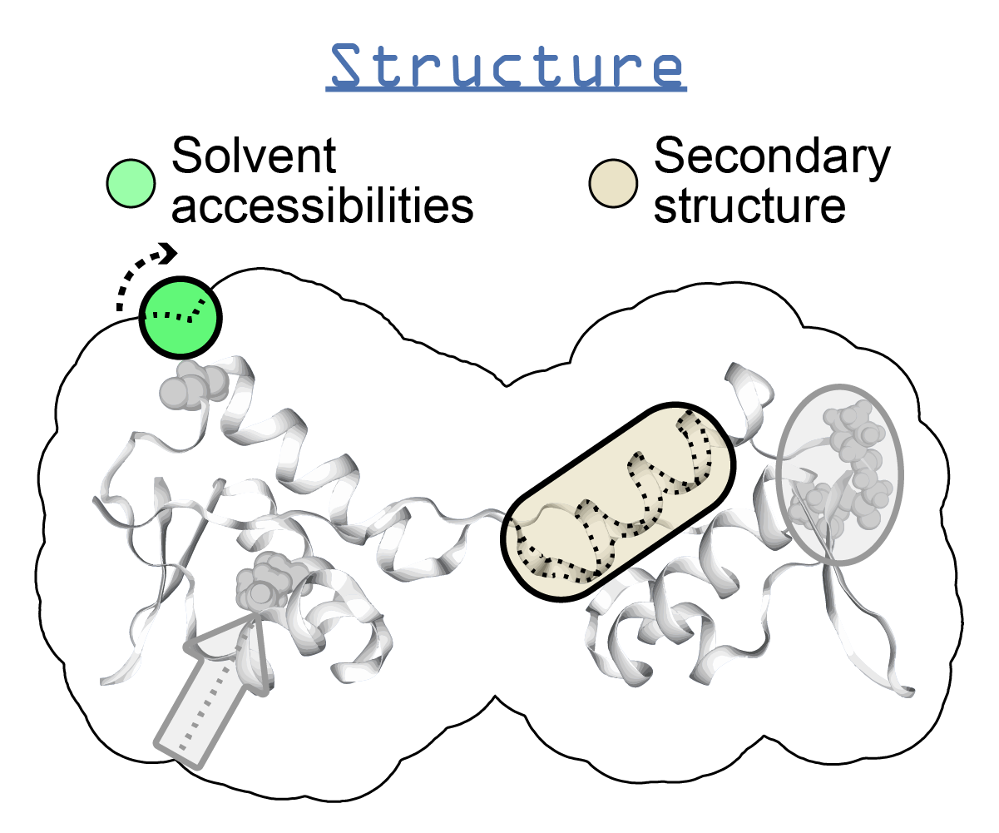

.. _dssp:

**********************************
DSSP
**********************************

Description
===========

* `DSSP home page`_

DSSP (**D**\ efine **S**\ econdary **S**\ tructure of **P**\ roteins) is the standard method used to assign secondary structure annotations to a protein structure. DSSP utilizes the atomic coordinates of a structure to assign the secondary codes, which are:

+------+-------------+
| Code | Description |
+======+=============+
| H    | Alpha helix |
+------+-------------+
| B    | Beta bridge |
+------+-------------+
| E    | Strand      |
+------+-------------+
| G    | Helix-3     |
+------+-------------+
| I    | Helix-5     |
+------+-------------+
| T    | Turn        |
+------+-------------+
| S    | Bend        |
+------+-------------+

Furthermore, DSSP calculates geometric properties such as the phi and psi angles between residues and solvent accessibilities. *ssbio* provides wrappers around the Biopython DSSP module to execute and parse DSSP results, as well as converting the information into a Pandas DataFrame format with calculated relative solvent accessbilities (see :mod:`ssbio.protein.structure.properties.dssp` for details).

Instructions (Ubuntu)
=====================

.. note:: These instructions were created on an Ubuntu 17.04 system.

#. Install the DSSP package
    
    .. code-block:: console

        sudo apt-get install dssp

#. The program installs itself as ``mkdssp``, not ``dssp``, and Biopython looks to execute ``dssp``, so we need to symlink the name ``dssp`` to ``mkdssp``

    .. code-block:: console
        
        sudo ln -s /usr/bin/mkdssp /usr/bin/dssp

#. Then you should be able to run ``dssp`` in your terminal
   

Instructions (Mac OSX)
======================

* `Instructions for installing on Mac`_
* `Instructions for installing on Mac (alternate)`_

FAQs
====

* How do I cite DSSP?

    - Kabsch W & Sander C (1983) DSSP: definition of secondary structure of proteins given a set of 3D coordinates. Biopolymers 22: 2577–2637
      
* I'm having issues running DSSP...

    - See the `ssbio wiki`_ for (hopefully) some solutions - or add yours in when you find the answer!

API
===

.. automodule:: ssbio.protein.structure.properties.dssp
    :members:

.. Links
.. _DSSP home page: http://swift.cmbi.ru.nl/gv/dssp/
.. _ssbio wiki: https://github.com/SBRG/ssbio/wiki/Troubleshooting
.. _Instructions for installing on Mac: http://biskit.pasteur.fr/install/applications/dssp
.. _Instructions for installing on Mac (alternate): http://proteinz.blogspot.com/2013/02/compiling-dssp-on-osx-lion-redux.html