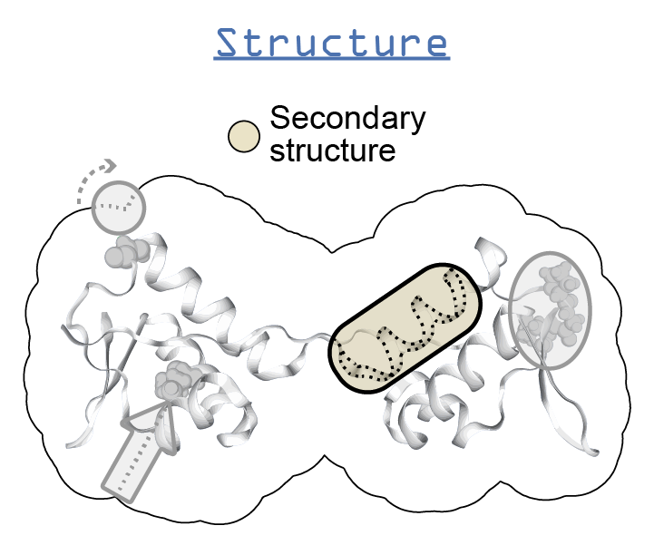

.. _dssp:

**********************************
DSSP
**********************************

Description
===========

* `DSSP home page`_

DSSP is...

Instructions
============

.. note:: These instructions were created on an Ubuntu 17.04 system.

* `Instructions for installing on Mac`_
* `Instructions for installing on Mac (alternate)`_

#. Install the DSSP package
    
    .. code-block:: console

        sudo apt-get install dssp

#. The program installs itself as ``mkdssp``, not ``dssp``, and Biopython looks to execute ``dssp``, so we need to symlink the name ``dssp`` to ``mkdssp``

    .. code-block:: console
        
        sudo ln -s /usr/bin/mkdssp /usr/bin/dssp

#. Then you should be able to run ``dssp`` in your terminal

FAQs
====

* How do I cite DSSP?

    - Kabsch W & Sander C (1983) DSSP: definition of secondary structure of proteins given a set of 3D coordinates. Biopolymers 22: 2577–2637

API
===

.. automodule:: ssbio.protein.structure.properties.dssp
    :members:

.. Links
.. _DSSP home page: http://swift.cmbi.ru.nl/gv/dssp/
.. _ssbio wiki: https://github.com/SBRG/ssbio/wiki/Troubleshooting
.. _Instructions for installing on Mac: http://biskit.pasteur.fr/install/applications/dssp
.. _Instructions for installing on Mac (alternate): http://proteinz.blogspot.com/2013/02/compiling-dssp-on-osx-lion-redux.html