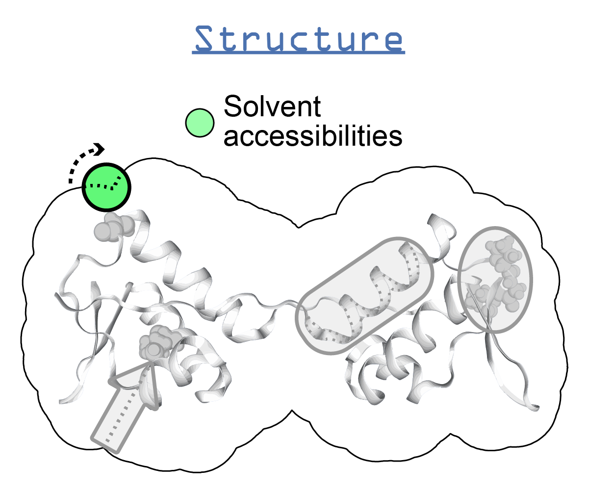

.. _freesasa:

**********************************
FreeSASA
**********************************

Description
===========

* `FreeSASA home page`_
* `FreeSASA Github`_

FreeSASA is an open source library written in C for calculating solvent accessible surface areas of a protein. FreeSASA also contains Python bidings, and the plan is to include these bindings with *ssbio* in the future.

Installation instructions (Unix)
================================

.. note:: These instructions were created on an Ubuntu 17.04 system with a Python installation through Anaconda3.

.. note:: FreeSASA Python bindings are slightly difficult to install with Python 3 - ssbio provides wrappers for the command line executable instead

#. Download the latest tarball (see `FreeSASA home page`_), expand it and run
    
    .. code-block:: console

        ./configure --disable-json --disable-xml
        make

#. Install with

    .. code-block:: console
    
        sudo make install

Program execution
=================

In the shell
------------

To run the program on its own in the shell...
   
    .. code-block:: console

        freesasa

With *ssbio*
------------

To run the program using the ssbio Python wrapper, see: :func:`ssbio.protein.structure.properties.freesasa.run_freesasa`

FAQs
====

* How do I cite FreeSASA?

    - Mitternacht S (2016) FreeSASA: An open source C library for solvent accessible surface area calculations. F1000Res. 5: 189 Available at: http://dx.doi.org/10.12688/f1000research.7931.1

* I'm having issues running FreeSASA...

    - See the `ssbio wiki`_ for (hopefully) some solutions - or add yours in when you find the answer!

API
===

.. automodule:: ssbio.protein.structure.properties.freesasa
    :members:

.. Links
.. _FreeSASA home page: http://freesasa.github.io/
.. _FreeSASA Github: https://github.com/mittinatten/freesasa
.. _ssbio wiki: https://github.com/SBRG/ssbio/wiki/Troubleshooting