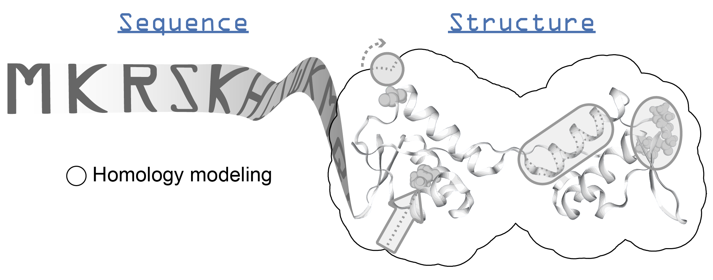

.. _itasser:

**********************************
I-TASSER
**********************************

Description
===========

* Home page: I-TASSER_
* Download link: `I-TASSER Suite`_

I-TASSER (Iterative Threading ASSEmbly Refinement) is a program for protein homology modeling and functional prediction from a protein sequence. The I-TASSER suite provides numerous other tools such as for ligand-binding site predictions, model refinement, secondary structure predictions, B-factor estimations, and more. *ssbio* mainly provides tools to run and parse I-TASSER homology modeling results, as well as COACH consensus binding site predictions (optionally with EC number and GO term predictions). Also, scripts are provided to automate homology modeling on a large scale using TORQUE_ or Slurm_ job schedulers in a cluster computing environment.

Instructions
============

.. note:: These instructions were created on an Ubuntu 17.04 system.

.. note:: Read the README on the** `I-TASSER Suite`_ **page for the most up-to-date instructions

#. Make sure you have Java installed and it can be run from the command line with ``java``
#. Head to the `I-TASSER download`_ page and register for an license (academic only) to get a password emailed to you
#. Log in to the `I-TASSER download`_ page and download the archive
#. Unpack the software archive into a convenient directory - a library should also be downloaded to this directory
#. Run ``download_lib.pl`` to then download the library files - this will take some time:

    .. code-block:: console

        /path/to/<I-TASSER_directory>/download_lib.pl -libdir ITLIB

#. Now, I-TASSER can be run according to the README under section 4
#. To enable GO term predictions...

    #) under construction...

#. Tip: to update template libraries, create a new command in your crontab (first run ``crontab -e``), and make sure to replace ``<USERNAME>`` with your username:

    .. code-block:: console

        0 4 * * 1,5 <USERNAME> /path/to/I-TASSER4.4/download_lib.pl -libdir /path/to/ITLIB

   That will run the library update at 4 am every Monday and Friday.

FAQs
====

* What is a homology model?

    - A predicted 3D structure model of a protein sequence. Models can be template-based, when they are based on an existing experimental structure; or *ab initio*, generated without a template. Generally, *ab initio* models are much less reliable.

* Can I just run I-TASSER using their web server and parse those results with *ssbio*?

    - Not yet, but you can manually input the model1.pdb file as a new structure for now.

* How do I cite I-TASSER?

    - Roy A, Kucukural A & Zhang Y (2010) I-TASSER: a unified platform for automated protein structure and function prediction. Nat. Protoc. 5: 725–738 Available at: http://dx.doi.org/10.1038/nprot.2010.5
      
* How do I run I-TASSER with TORQUE or Slurm job schedulers?

    - under construction...

* I'm having issues running I-TASSER...

    - See the `ssbio wiki`_ for (hopefully) some solutions - or add yours in when you find the answer!

API
===

.. automodule:: ssbio.protein.structure.homology.itasser.itasserprep
    :members:

.. automodule:: ssbio.protein.structure.homology.itasser.itasserprop
    :members:

.. Links
.. _I-TASSER: https://zhanglab.ccmb.med.umich.edu/I-TASSER/
.. _I-TASSER Suite: https://zhanglab.ccmb.med.umich.edu/I-TASSER/download/
.. _I-TASSER download: https://zhanglab.ccmb.med.umich.edu/I-TASSER/download/download.php
.. _TORQUE: https://en.wikipedia.org/wiki/TORQUE
.. _Slurm: https://en.wikipedia.org/wiki/Slurm_Workload_Manager
.. _ssbio wiki: https://github.com/SBRG/ssbio/wiki/Troubleshooting