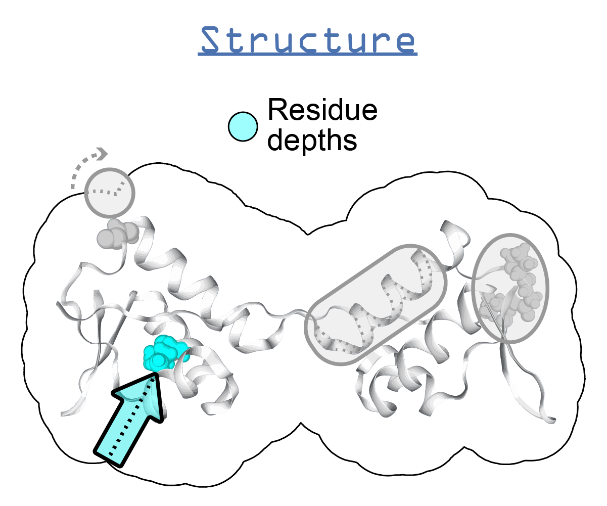

.. _msms:

****
MSMS
****

Description
===========

* `MSMS home page`_
* Download_
* Manual_ 
* Manuscript_ 

MSMS computes solvent excluded surfaces on a protein structure. Generally, MSMS is used to calculate residue depths (in Angstroms) from the surface of a protein, using a PDB file as an input. *ssbio* provides wrappers through Biopython to run MSMS as well as store the depths in an associated ``StructProp`` object.

Installation instructions (Unix)
================================

.. note:: These instructions were created on an Ubuntu 17.04 system.

#. Head to the Download_ page, and under the header "MSMS 2.6.X - Current Release" download the "Unix/Linux i86_64" version - if this doesn't work though you'll want to try the "Unix/Linux i86" version later.

#. Download it, unarchive it to your library path:
   
    .. code-block:: console

        sudo mkdir /usr/local/lib/msms
        cd /usr/local/lib/msms
        tar zxvf /path/to/your/downloaded/file/msms_i86_64Linux2_2.6.1.tar.gz

#. Symlink the binaries (or alternatively, add the two locations to your PATH):

    .. code-block:: console

        sudo ln -s /usr/local/lib/msms/msms.x86_64Linux2.2.6.1 /usr/local/bin/msms
        sudo ln -s /usr/local/lib/msms/pdb_to_xyzr* /usr/local/bin

#. Fix a bug in the pdb_to_xyzr file (see: http://mailman.open-bio.org/pipermail/biopython/2015-November/015787.html):
   
    .. code-block:: console

        sudo vi /usr/local/lib/msms/pdb_to_xyzr

    at line 34, change:

    .. code-block:: console

        numfile = "./atmtypenumbers"

    to:

    .. code-block:: console

        numfile = "/usr/local/lib/msms/atmtypenumbers"

#. Repeat step 5 for the file ``/usr/local/lib/msms/pdb_to_xyzrn``

#. Now try running ``msms`` in the terminal, it should say:
   
    .. code-block:: console

        $ msms
        MSMS 2.6.1 started on structure
        Copyright M.F. Sanner (1994)
        Compilation flags -O2 -DVERBOSE -DTIMING
        MSMS: No input stream specified

Program execution
=================

In the shell
------------

To run the program on its own in the shell...
   
    .. code-block:: console

        <code>

With *ssbio*
------------

To run the program using the ssbio Python wrapper, see: :func:`ssbio.protein.path.to.wrapper`

FAQs
====

* How do I cite MSMS?

    - Sanner MF, Olson AJ & Spehner J-C (1996) Reduced surface: an efficient way to compute molecular surfaces. Biopolymers 38: 305–320. Available at: http://mgl.scripps.edu/people/sanner/html/papers/msmsTextAndFigs.pdf

* How long does it take to run?

    - Depending on the size of the protein structure, the program can take up to a couple minutes to execute.
      
* I'm having issues running MSMS...

    - See the `ssbio wiki`_ for (hopefully) some solutions - or add yours in when you find the answer!

API
===

.. automodule:: ssbio.protein.structure.properties.msms
    :members:

.. Links
.. _MSMS home page: http://mgl.scripps.edu/people/sanner/html/msms_home.html
.. _Download: http://mgltools.scripps.edu/downloads#msms
.. _Manual: http://mgl.scripps.edu/people/sanner/html/msms_man.html
.. _Manuscript: http://mgl.scripps.edu/people/sanner/html/papers/msmsTextAndFigs.pdf
.. _ssbio wiki: https://github.com/SBRG/ssbio/wiki/Troubleshooting