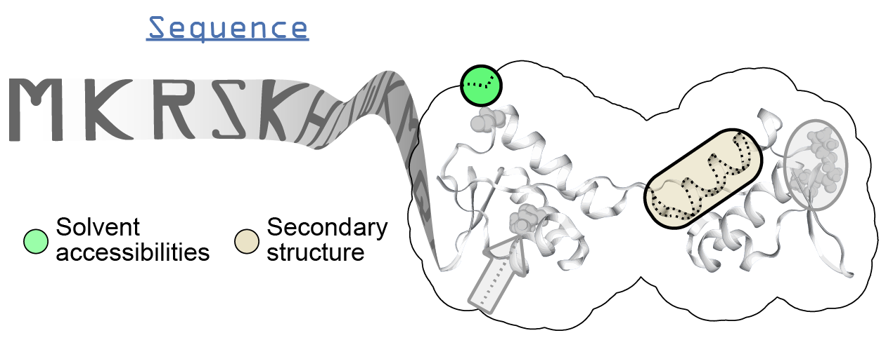

.. _scratch:

**********************************
SCRATCH
**********************************

Description
===========

* `SCRATCH home page`_
* `SCRATCH download page (for SSpro and ACCpro)`_

SCRATCH is a suite of tools to predict many types of structural properties directly from sequence. *ssbio* contains wrappers to execute and parse results from *SSpro*/*SSpro8* - predictors of secondary structure, and *ACCpro*/*ACCpro20* - predictors of solvent accessibility.

Instructions
============

.. note:: These instructions were created on an Ubuntu 17.04 system.

#. Download the source and install it using the perl script:

    .. code-block:: console

        wget http://download.igb.uci.edu/SCRATCH-1D_1.1.tar.gz
        tar -xvzf SCRATCH-1D_1.1.tar.gz
        cd SCRATCH-1D_1.1
        perl install.pl

#. To run it from the command line directly:
    
    .. code-block:: console

        ./run_SCRATCH-1D_predictors.sh  input_fasta  output_prefix  [num_threads]

#. *ssbio* also provides command line wrappers to run it and parse the results, see :mod:`ssbio.protein.sequence.properties.scratch` for details.

FAQs
====

* How do I cite SCRATCH?

    - Cheng J, Randall AZ, Sweredoski MJ & Baldi P (2005) SCRATCH: a protein structure and structural feature prediction server. Nucleic Acids Res. 33: W72–6 Available at: http://dx.doi.org/10.1093/nar/gki396

API
===

.. automodule:: ssbio.protein.sequence.properties.scratch
    :members:

.. Links
.. _SCRATCH home page: http://scratch.proteomics.ics.uci.edu/
.. _SCRATCH download page (for SSpro and ACCpro): http://download.igb.uci.edu/#sspro
