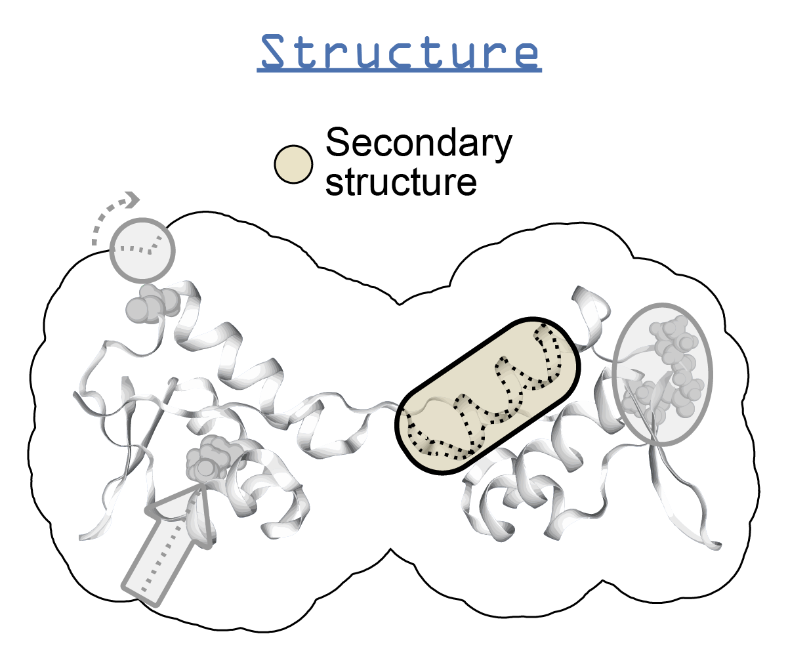

.. _stride:

******
STRIDE
******

Description
===========

* `STRIDE home page`_
* `STRIDE download page`_
* `STRIDE documentation`_

STRIDE (**St**\ ructural **ide**\ ntification) is a program used to assign secondary structure annotations to a protein structure. STRIDE has slightly more complex criteria to assign codes compared to dssp_. STRIDE utilizes the atomic coordinates of a structure to assign the structure codes, which are:

+--------+--------------------------+
| Code   | Description              |
+========+==========================+
| H      | Alpha helix              |
+--------+--------------------------+
| G      | 3-10 helix               |
+--------+--------------------------+
| I      | PI-helix                 |
+--------+--------------------------+
| E      | Extended conformation    |
+--------+--------------------------+
| B or b | Isolated bridge          |
+--------+--------------------------+
| T      | Turn                     |
+--------+--------------------------+
| C      | Coil (none of the above) |
+--------+--------------------------+

Instructions (Unix)
===================

.. note:: These instructions were created on an Ubuntu 17.04 system.

#. Download the source from the `STRIDE download page`_
   
#. Create a new folder named "stride" in a place where you store software and extract the source into it

    .. code-block:: console

        mkdir /path/to/software/stride
        cp /path/to/downloaded/stride.tar.gz /path/to/software/stride
        cd /path/to/software/stride
        tar -zxf stride.tar.gz

#. Build the program from source and copy its binary:

    .. code-block:: console
        
        cd /path/to/software/stride
        make
        cp stride /usr/local/bin

#. Then you should be able to run ``stride`` in your terminal

FAQs
====

* How do I cite STRIDE?

    - Frishman D & Argos P (1995) Knowledge-based protein secondary structure assignment. Proteins 23: 566–579 Available at: http://dx.doi.org/10.1002/prot.340230412

* I'm having issues running STRIDE...

    - See the `ssbio wiki`_ for (hopefully) some solutions - or add yours in when you find the answer!

API
===

.. automodule:: ssbio.protein.structure.properties.stride
    :members:

.. Links
.. _STRIDE home page: http://webclu.bio.wzw.tum.de/stride/
.. _STRIDE download page: http://webclu.bio.wzw.tum.de/stride/install.html
.. _STRIDE documentation: http://webclu.bio.wzw.tum.de/stride/stride.doc
.. _ssbio wiki: https://github.com/SBRG/ssbio/wiki/Troubleshooting