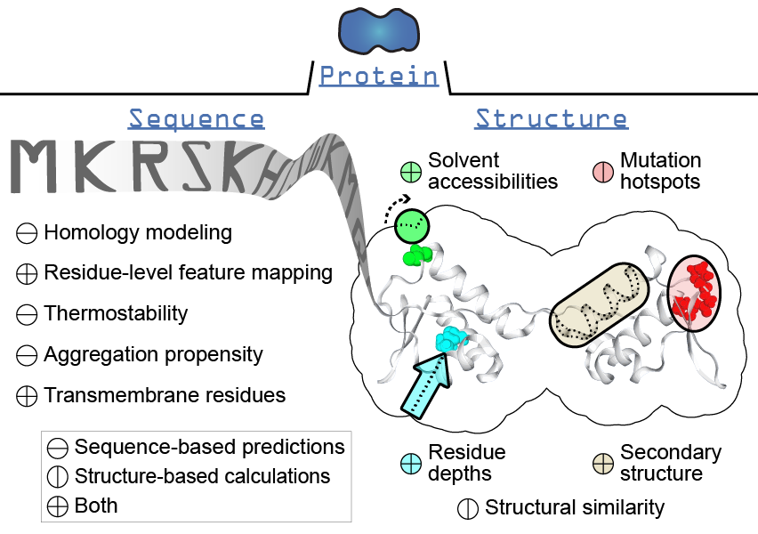

.. _protein:

*****************
The Protein Class
*****************

Tutorials
=========

.. toctree::
   :glob:
   :maxdepth: 1

   notebooks/Protein*

Introduction
============

This section will give an overview of the methods that can be executed for the Protein class, which is a basic representation of a protein by a collection of amino acid sequences and 3D structures.

Features
========

#. Load, parse, and store the same (ie. from different database sources) or similar (ie. from different strains) protein sequences as ``SeqProp`` objects in the ``sequences`` attribute
#. Load, parse, and store multiple experimental or predicted protein structures as ``StructProp`` objects in the ``structures`` attribute
#. Set a single representative sequence and structure
#. Calculate, store, and access pairwise sequence alignments to the representative sequence or structure
#. Provide summaries of alignments and mutations seen
#. Map between residue numbers of sequences and structures

Object attributes
=================

Further reading
===============

For examples in which tools from the Protein class have been used for analysis, please see the following:

.. [#] Broddrick JT, Rubin BE, Welkie DG, Du N, Mih N, Diamond S, et al. Unique attributes of cyanobacterial metabolism revealed by improved genome-scale metabolic modeling and essential gene analysis. Proc Natl Acad Sci U S A. 2016;113: E8344–E8353. doi:10.1073/pnas.1613446113
.. [#] Mih N, Brunk E, Bordbar A, Palsson BO. A Multi-scale Computational Platform to Mechanistically Assess the Effect of Genetic Variation on Drug Responses in Human Erythrocyte Metabolism. PLoS Comput Biol. 2016;12: e1005039. doi:10.1371/journal.pcbi.1005039