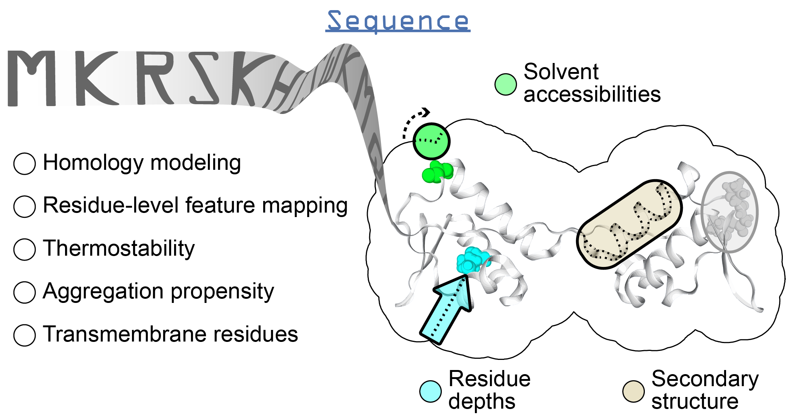

.. _sequence:

*******************
The SeqProp Class
*******************

Introduction
============
This section will give an overview of the methods that can be executed for a single protein sequence.

Tutorials
=========

.. toctree::
    :glob:
    :maxdepth: 1

    notebooks/SeqProp*

Available functions
===================

.. role:: raw-html(raw)
   :format: html

Sequence-based predictions
--------------------------

+---------------------------------------------------------------------------------------+--------------------------------------------------------------------------------------------------------------------------------------------------------------------------------------------------------------------+-------------------------------------------------------------------------------------------------+-------------------------------------------------+------------------------------+-----------------------------------------------------------+
| Function                                                                              | Description                                                                                                                                                                                                        | Internal Python class :raw-html:` ` used and functions provided                            | External software :raw-html:` ` to install | Web server                   | Alternate external :raw-html:` ` software to install |
+=======================================================================================+====================================================================================================================================================================================================================+=================================================================================================+=================================================+==============================+===========================================================+
| Aggregation propensity                                                                | Consensus method to predict the aggregation :raw-html:` ` propensity of proteins, specifically the number :raw-html:` ` of aggregation-prone segments on an unfolded :raw-html:` ` protein sequence | :mod:`aggregation_propensity module <ssbio.protein.sequence.properties.aggregation_propensity>` |                                                 | :doc:`instructions/amylpred` |                                                           |
+---------------------------------------------------------------------------------------+--------------------------------------------------------------------------------------------------------------------------------------------------------------------------------------------------------------------+-------------------------------------------------------------------------------------------------+-------------------------------------------------+------------------------------+-----------------------------------------------------------+
| Secondary structure :raw-html:` ` and :raw-html:` ` solvent accessibilities | Predictions of secondary structure and :raw-html:` ` relative solvent accessibilities per residue                                                                                                             | :mod:`scratch module <ssbio.protein.sequence.properties.scratch>`                               | :doc:`instructions/scratch`                     |                              |                                                           |
+---------------------------------------------------------------------------------------+--------------------------------------------------------------------------------------------------------------------------------------------------------------------------------------------------------------------+-------------------------------------------------------------------------------------------------+-------------------------------------------------+------------------------------+-----------------------------------------------------------+
| Thermostability                                                                       | Free energy of unfolding (ΔG), adapted from :raw-html:` ` Oobatake (Oobatake & Ooi 1993) and Dill (Dill et al. 2011)                                                                                          | :mod:`thermostability module <ssbio.protein.sequence.properties.thermostability>`               |                                                 |                              |                                                           |
+---------------------------------------------------------------------------------------+--------------------------------------------------------------------------------------------------------------------------------------------------------------------------------------------------------------------+-------------------------------------------------------------------------------------------------+-------------------------------------------------+------------------------------+-----------------------------------------------------------+
| Transmembrane domains                                                                 | Prediction of transmembrane domains from sequence                                                                                                                                                                  | :mod:`tmhmm module <ssbio.protein.sequence.properties.tmhmm>`                                   | :doc:`instructions/tmhmm`                       |                              |                                                           |
+---------------------------------------------------------------------------------------+--------------------------------------------------------------------------------------------------------------------------------------------------------------------------------------------------------------------+-------------------------------------------------------------------------------------------------+-------------------------------------------------+------------------------------+-----------------------------------------------------------+

Sequence-based calculations
---------------------------

+---------------------------------------------------------------------------------------+--------------------------------------------------------------------------------------------------------------------------------------------------------------------------------------------------------------------+-------------------------------------------------------------------------------------------------+-------------------------------------------------+------------------------------+-----------------------------------------------------------+
| Function                                                                              | Description                                                                                                                                                                                                        | Internal Python class :raw-html:` ` used and functions provided                            | External software :raw-html:` ` to install | Web server                   | Alternate external :raw-html:` ` software to install |
+=======================================================================================+====================================================================================================================================================================================================================+=================================================================================================+=================================================+==============================+===========================================================+
| Various sequence :raw-html:` ` properties                                        | Basic properties of the sequence, such as :raw-html:` ` percent of polar, non-polar, hydrophobic :raw-html:` ` or hydrophilic residues.                                                                  | - `Biopython ProteinAnalysis`_                                                                  |                                                 |                              | :doc:`instructions/emboss` *pepstats*                     |
|                                                                                       |                                                                                                                                                                                                                    | - :mod:`sequence residues module <ssbio.protein.sequence.properties.residues>`                  |                                                 |                              |                                                           |
+---------------------------------------------------------------------------------------+--------------------------------------------------------------------------------------------------------------------------------------------------------------------------------------------------------------------+-------------------------------------------------------------------------------------------------+-------------------------------------------------+------------------------------+-----------------------------------------------------------+
| Sequence alignment                                                                    | Basic functions to run pairwise or multiple :raw-html:` ` sequence alignments                                                                                                                                 | - `Biopython pairwise2`_                                                                        |                                                 |                              | :doc:`instructions/emboss` *needle*                       |
|                                                                                       |                                                                                                                                                                                                                    | - :mod:`alignment module <ssbio.protein.sequence.utils.alignment>`                              |                                                 |                              |                                                           |
+---------------------------------------------------------------------------------------+--------------------------------------------------------------------------------------------------------------------------------------------------------------------------------------------------------------------+-------------------------------------------------------------------------------------------------+-------------------------------------------------+------------------------------+-----------------------------------------------------------+

API
===

.. automodule:: ssbio.protein.sequence.seqprop
    :members:

    
.. Links

.. _Biopython ProteinAnalysis: http://biopython.org/wiki/ProtParam
.. _Biopython pairwise2: http://biopython.org/DIST/docs/api/Bio.pairwise2-module.html