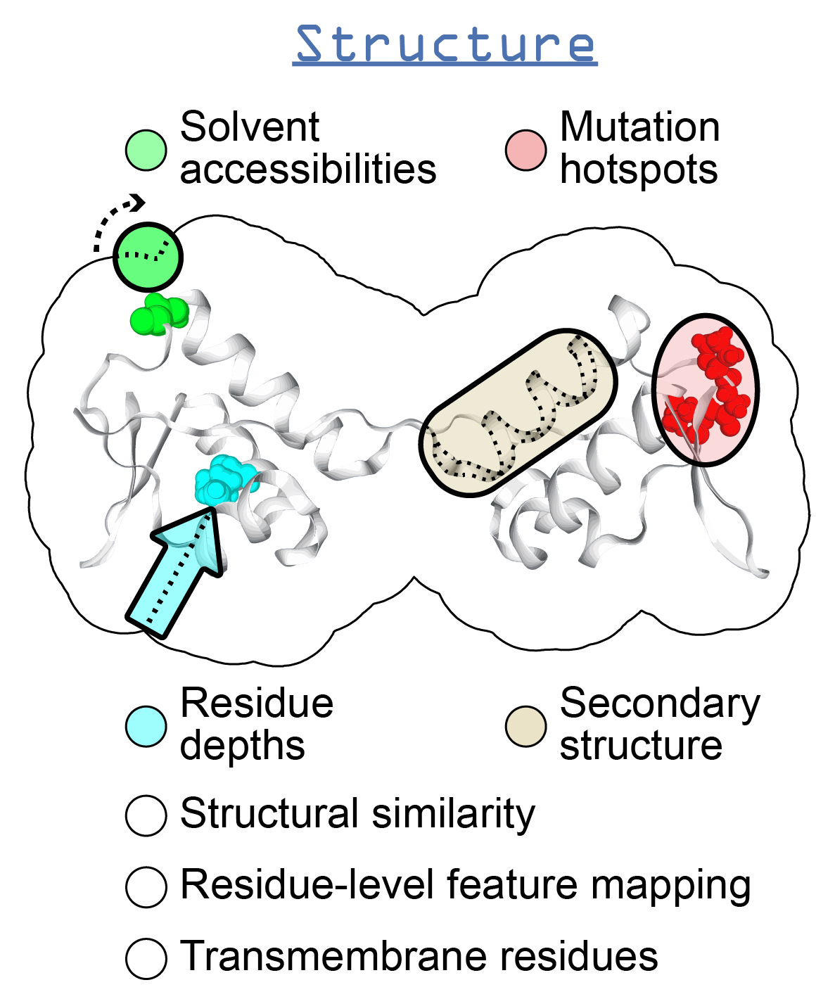

.. _structure:

********************
The StructProp Class
********************

Introduction
============
This section will give an overview of the methods that can be executed for a single protein structure.

Tutorials
=========

.. toctree::
    :glob:
    :maxdepth: 1

    notebooks/StructProp*
    notebooks/PDBProp*
    notebooks/FATCAT*
            

Available functions
===================

.. role:: raw-html(raw)
   :format: html

Sequence & structure-based predictions
--------------------------------------

+-------------------------------------------------+-------------------------------------------------------------------------------------------------------------------------------------------------------------------------------------------------------------------------------------------------------------+---------------------------------------------------------------------------------------------------------+-------------------------------------------------+------------------------------+-----------------------------------------------------------+
| Function                                        | Description                                                                                                                                                                                                                                                 | Internal Python class :raw-html:` ` used and functions provided                                    | External software :raw-html:` ` to install | Web server                   | Alternate external :raw-html:` ` software to install |
+=================================================+=============================================================================================================================================================================================================================================================+=========================================================================================================+=================================================+==============================+===========================================================+
| Homology modeling                               | Preparation scripts and parsers for :raw-html:` ` executing homology modeling algorithms                                                                                                                                                               | - :mod:`itasserprep module <ssbio.protein.structure.homology.itasser.itasserprep>`                      | :doc:`instructions/itasser`                     |                              |                                                           |
|                                                 |                                                                                                                                                                                                                                                             | - :mod:`itasserprop module <ssbio.protein.structure.homology.itasser.itasserprop>`                      |                                                 |                              |                                                           |
+-------------------------------------------------+-------------------------------------------------------------------------------------------------------------------------------------------------------------------------------------------------------------------------------------------------------------+---------------------------------------------------------------------------------------------------------+-------------------------------------------------+------------------------------+-----------------------------------------------------------+
| Kinetic folding rate                            | Prediction of protein folding rates :raw-html:` ` from amino acid sequence                                                                                                                                                                             | :mod:`kinetic_folding_rate module <ssbio.protein.sequence.properties.kinetic_folding_rate>`             |                                                 | :doc:`instructions/foldrate` |                                                           |
+-------------------------------------------------+-------------------------------------------------------------------------------------------------------------------------------------------------------------------------------------------------------------------------------------------------------------+---------------------------------------------------------------------------------------------------------+-------------------------------------------------+------------------------------+-----------------------------------------------------------+
| Transmembrane :raw-html:` ` orientation    | Prediction of transmembrane domains and :raw-html:` ` orientation in a membrane                                                                                                                                                                        | :mod:`opm module <ssbio.protein.structure.properties.opm>`                                              |                                                 | :doc:`instructions/opm`      |                                                           |
+-------------------------------------------------+-------------------------------------------------------------------------------------------------------------------------------------------------------------------------------------------------------------------------------------------------------------+---------------------------------------------------------------------------------------------------------+-------------------------------------------------+------------------------------+-----------------------------------------------------------+

Structure-based calculations or functions
-----------------------------------------

+-------------------------------------------------+-------------------------------------------------------------------------------------------------------------------------------------------------------------------------------------------------------------------------------------------------------------+---------------------------------------------------------------------------------------------------------+-------------------------------------------------+------------------------------+-----------------------------------------------------------+
| Function                                        | Description                                                                                                                                                                                                                                                 | Internal Python class :raw-html:` ` used and functions provided                                    | External software :raw-html:` ` to install | Web server                   | Alternate external :raw-html:` ` software to install |
+=================================================+=============================================================================================================================================================================================================================================================+=========================================================================================================+=================================================+==============================+===========================================================+
| Secondary structure                             | Calculations of secondary structure                                                                                                                                                                                                                         | - `Biopython DSSP`_                                                                                     | :doc:`instructions/dssp`                        |                              | :doc:`instructions/stride`                                |
|                                                 |                                                                                                                                                                                                                                                             | - :mod:`dssp module <ssbio.protein.structure.properties.dssp>`                                          |                                                 |                              |                                                           |
|                                                 |                                                                                                                                                                                                                                                             | - :mod:`stride module <ssbio.protein.structure.properties.stride>`                                      |                                                 |                              |                                                           |
+-------------------------------------------------+-------------------------------------------------------------------------------------------------------------------------------------------------------------------------------------------------------------------------------------------------------------+---------------------------------------------------------------------------------------------------------+-------------------------------------------------+------------------------------+-----------------------------------------------------------+
| Solvent accessibilities                         | Calculations of per-residue absolute and :raw-html:` ` relative solvent accessibilities                                                                                                                                                                | - `Biopython DSSP`_                                                                                     | :doc:`instructions/dssp`                        |                              | :doc:`instructions/freesasa`                              |
|                                                 |                                                                                                                                                                                                                                                             | - :mod:`dssp module <ssbio.protein.structure.properties.dssp>`                                          |                                                 |                              |                                                           |
|                                                 |                                                                                                                                                                                                                                                             | - :mod:`freesasa module <ssbio.protein.structure.properties.freesasa>`                                  |                                                 |                              |                                                           |
+-------------------------------------------------+-------------------------------------------------------------------------------------------------------------------------------------------------------------------------------------------------------------------------------------------------------------+---------------------------------------------------------------------------------------------------------+-------------------------------------------------+------------------------------+-----------------------------------------------------------+
| Residue depths                                  | Calculations of residue depths                                                                                                                                                                                                                              | - `Biopython ResidueDepth`_                                                                             | :doc:`instructions/msms`                        |                              |                                                           |
|                                                 |                                                                                                                                                                                                                                                             | - :mod:`msms module <ssbio.protein.structure.properties.msms>`                                          |                                                 |                              |                                                           |
+-------------------------------------------------+-------------------------------------------------------------------------------------------------------------------------------------------------------------------------------------------------------------------------------------------------------------+---------------------------------------------------------------------------------------------------------+-------------------------------------------------+------------------------------+-----------------------------------------------------------+
| Structural similarity                           | Pairwise calculations of 3D structural :raw-html:` ` similarity                                                                                                                                                                                        | :mod:`fatcat module <ssbio.protein.structure.properties.fatcat>`                                        | :doc:`instructions/fatcat`                      |                              |                                                           |
+-------------------------------------------------+-------------------------------------------------------------------------------------------------------------------------------------------------------------------------------------------------------------------------------------------------------------+---------------------------------------------------------------------------------------------------------+-------------------------------------------------+------------------------------+-----------------------------------------------------------+
| Quality                                         | Custom functions to allow ranking of :raw-html:` ` structures by percent identity to a defined :raw-html:` ` sequence, structure resolution, and other structure :raw-html:` ` quality metrics                                               | :func:`set_representative_structure function <ssbio.core.protein.Protein.set_representative_structure>` |                                                 |                              |                                                           |
+-------------------------------------------------+-------------------------------------------------------------------------------------------------------------------------------------------------------------------------------------------------------------------------------------------------------------+---------------------------------------------------------------------------------------------------------+-------------------------------------------------+------------------------------+-----------------------------------------------------------+
| Various structure :raw-html:` ` properties | Basic properties of the structure, such :raw-html:` ` as distance measurements between residues :raw-html:` ` or number of disulfide bridges                                                                                                      | - `Biopython Struct`_                                                                                   |                                                 |                              |                                                           |
|                                                 |                                                                                                                                                                                                                                                             | - :mod:`structure residues module <ssbio.protein.structure.properties.residues>`                        |                                                 |                              |                                                           |
+-------------------------------------------------+-------------------------------------------------------------------------------------------------------------------------------------------------------------------------------------------------------------------------------------------------------------+---------------------------------------------------------------------------------------------------------+-------------------------------------------------+------------------------------+-----------------------------------------------------------+
| Structure cleaning, :raw-html:` ` mutating | Custom functions to allow for the preparation :raw-html:` ` of structure files for molecular modeling, with :raw-html:` ` options to remove hydrogens/waters/heteroatoms, :raw-html:` ` select specific chains, or mutate specific residues. | - `Biopython Select`_                                                                                   | AmberTools_                                     |                              |                                                           |
|                                                 |                                                                                                                                                                                                                                                             | - :mod:`cleanpdb module<ssbio.protein.structure.utils.cleanpdb>`                                        |                                                 |                              |                                                           |
|                                                 |                                                                                                                                                                                                                                                             | - :mod:`mutatepdb module <ssbio.protein.structure.utils.mutatepdb>`                                     |                                                 |                              |                                                           |
+-------------------------------------------------+-------------------------------------------------------------------------------------------------------------------------------------------------------------------------------------------------------------------------------------------------------------+---------------------------------------------------------------------------------------------------------+-------------------------------------------------+------------------------------+-----------------------------------------------------------+

.. Links

.. _Biopython Structure: http://biopython.org/wiki/The_Biopython_Structural_Bioinformatics_FAQ
.. _Biopython DSSP: http://biopython.org/DIST/docs/api/Bio.PDB.DSSP%27-module.html
.. _Biopython ResidueDepth: http://biopython.org/DIST/docs/api/Bio.PDB.ResidueDepth%27-module.html
.. _Biopython Struct: http://biopython.org/wiki/Struct
.. _Biopython Select: http://biopython.org/DIST/docs/api/Bio.PDB.PDBIO%27.Select-class.html
.. _AmberTools: http://ambermd.org/#AmberTools